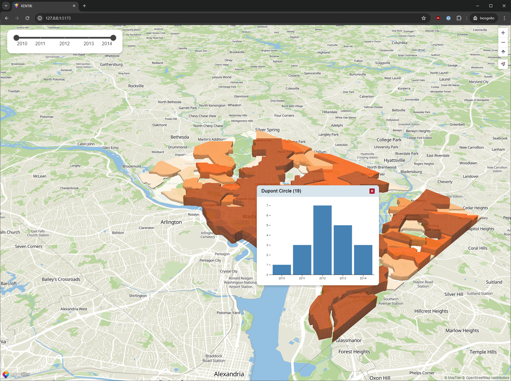

# Kentik Takehome Summer 2024 (Dan J.)

This is a 3D choropleth map representing impaired car crashes by neighborhood in the Washington, D.C. area over a five year period (2010-2014).



You can click on a section to view the breakdown year-by-year or filter the years in a range setting from the top-left.

## Getting Started

First, we're going to install pnpm: `npm install -g pnpm`.

Then, to see run build locally, go inside the root folder from this git repo you cloned:

```bash
pnpm install
pnpm dev
```

### Type-Check, Compile and Minify for Production

```sh
pnpm build
```
